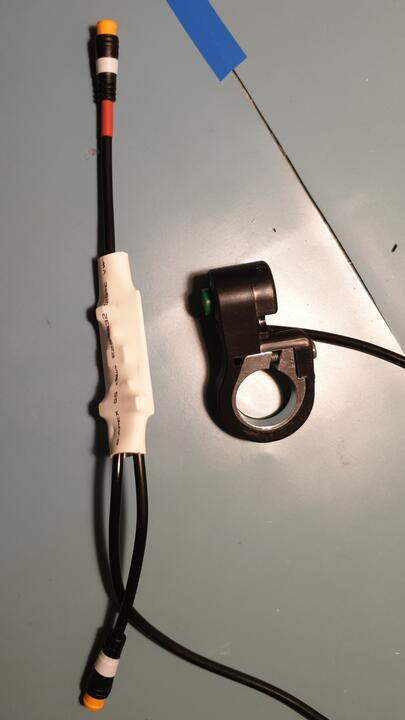
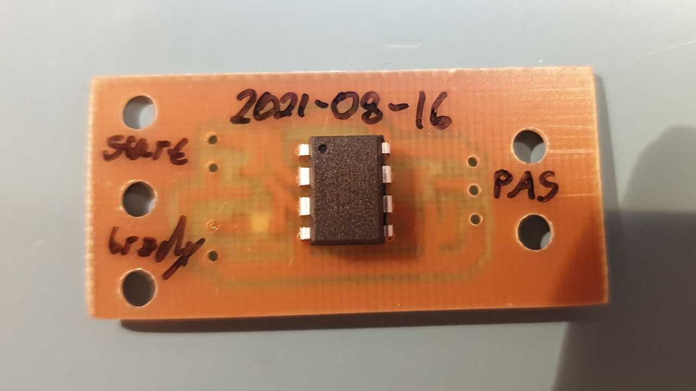
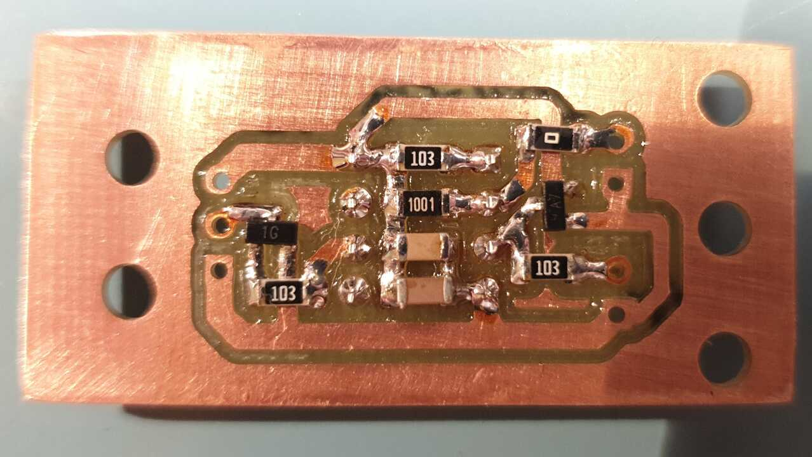

# e-bike PAS signal generator
Eunorau Sin-wave LD-FXK-038 e-bike controller is often used on electric kick
scooters, but those don't have pedals, so you cannot make use of the pedal
assist (PAS) feature. This simple device generates a valid pedalling signal to
achieve cruise control-like functionality.

## Usage
Hold the start button for at least 2 seconds to enable PAS. Start braking to
turn it off.

